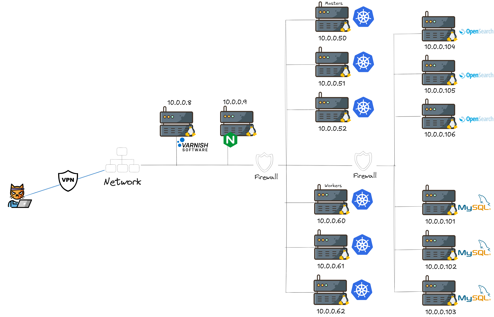

# 🧪 Prueba Técnica – Ravenloop

Este repositorio forma parte de una prueba técnica para un DevOps en **Ravenloop**.  
No existen respuestas cerradas ni soluciones únicas: buscamos reflejar **cómo piensas, cómo estructuras la información y cómo identificas necesidades y mejoras en entornos realistas**.

---

## 🔍 ¿Qué buscamos?

El objetivo de esta prueba es que analices y expliques los diferentes archivos de configuración incluidos en este repositorio. La idea es que sea en una charla en vivo con nosotros donde puedas modificar, comentar o ampliar cualquier parte del contenido en tu local si lo consideras necesario.

### 1. ✏️ Explicación de cada fichero de configuración

Hay dos directorios a analizar Desarrollo y kubernetes, queremos saber una serie de cosas de cada uno de ellos:

- **¿Qué función cumple el fichero** y para qué crees que sirve cada sección?.
- **Qué estructura tiene cada directorio y por qué está organizado así?**.
- **Comentarios o sugerencias sobre errores, ambigüedades o mejoras posibles**.
- **Valoraciones sobre la claridad, mantenibilidad y buenas prácticas** de cada fichero.

---

### 2. ⚙️ Explicación del funcionamiento global

Queremos entender cómo comprendes **el conjunto del entorno**, es decir:

- Cómo interactúan entre sí los componentes (servicios, volúmenes, redes, pipelines, etc.).
- Cuál es el **flujo de trabajo** entre los distintos elementos para un desarrollador.
- Qué implicaciones tiene la arquitectura actual en cuanto a despliegue, mantenimiento o escalado

---

### 3. 🏗️ Visión de la arquitectura

Cada uno de los entornos tiene la siguiente arquitectura:

- ¿Cual sería tu estrategia de despliegue de cada elemento?
- ¿Cómo garantizarías la continuidad del dato en cada despliegue?
- ¿Se adapta bien la arquitectura a un entorno CI/CD moderno?, razona tu respuesta.

---

### 4. 🧰 Recomendaciones y mejoras

Además del análisis, queremos tus **recomendaciones técnicas**:

- ¿Qué servicios podrían complementar la arquitectura (monitorización, logging, cache, tracing…)?
- ¿Qué configuraciones de seguridad faltan?
- ¿Cambiarías el modo de exponer servicios en kubernetes (razona la respuesta)?
- ¿Hay mejores prácticas que se podrían aplicar para producción?

## 🧠 Recomendaciones para la reunión

- Sé claro, pero no temas dejar opiniones técnicas subjetivas, es lo que buscamos.
- Las premisas de calidad y seguridad van primero, si hay algo que crees que está mal o es un peligro dilo.
- Los comentarios con visión crítica o propuestas realistas de mejora se valoran mucho más que “respuestas agradables”.
- No tengas miedo de buscar en internet ayudas de documentación técnica o ideas de código, tienes poco tiempo usaló para reforzar tus ideas.
- Si tienes que buscar, sólo tienes que compartir pantalla y explicarnos la razón por la cual crees que el resultado elegido es la opción correcta para ti.

---

**¡Gracias por tu tiempo y por compartir tu forma de pensar!**

> Equipo de Ingeniería — Ravenloop